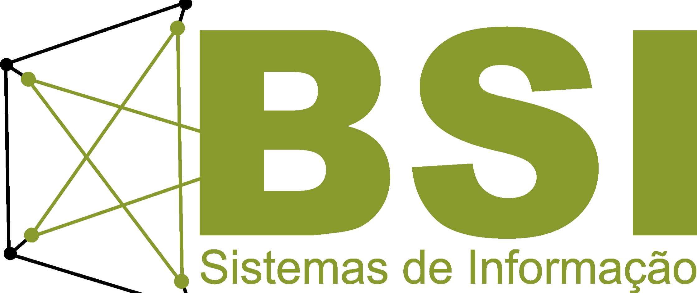

# BSI Codes - UFRPE/2022.1

Welcome to the official code repository for the Bachelor of Information Systems (BSI) Class of 2022.1 at the Federal Rural University of Pernambuco (UFRPE). Here you'll find a collection of projects, assignments, and coding exercises undertaken by our talented cohort throughout the semester.

## About Us

We are a group of enthusiastic and dedicated BSI students from UFRPE, embarking on a journey of exploration and innovation in the world of information systems. Our diverse backgrounds and shared passion for coding and technology have led us to collaborate on a range of exciting projects that showcase our growth and learning.

## Repository Highlights

This repository is a testament to our hard work and commitment to mastering various programming languages, tools, and concepts. Here's what you can expect to find:

- **Projects:** A curated list of group and individual projects that demonstrate our creativity and problem-solving skills.

- **Assignments:** A collection of assignments that challenged us to apply theoretical knowledge to real-world scenarios.

- **Coding Challenges:** Solutions to coding challenges and exercises that honed our algorithmic thinking and coding prowess.

- **Documentation:** Detailed documentation for our projects, providing insights into our thought processes, methodologies, and outcomes.

- **Collaboration:** An embodiment of our teamwork, highlighting how we effectively collaborated on code, resolved conflicts, and supported each other's growth.

## How to Navigate the Repository

Feel free to explore our repository and delve into the various folders corresponding to different projects and assignments. Each folder contains its own README files, providing context, instructions, and insights into the work we've done. Don't hesitate to dive into the code, explore our approaches, and gain inspiration from our projects.

## Get Involved

We believe in the power of open collaboration and knowledge sharing. If you're a fellow BSI enthusiast, a curious developer, or anyone interested in technology, feel free to:

- **Fork** this repository to your GitHub account.
- **Star** repositories that intrigue you and that you find valuable.
- **Open Issues** for any questions, feedback, or suggestions you might have.
- **Submit Pull Requests** if you've discovered issues or want to contribute improvements.

Let's continue to learn, innovate, and shape the future of information systems together! 🚀👩‍💻👨‍💻
